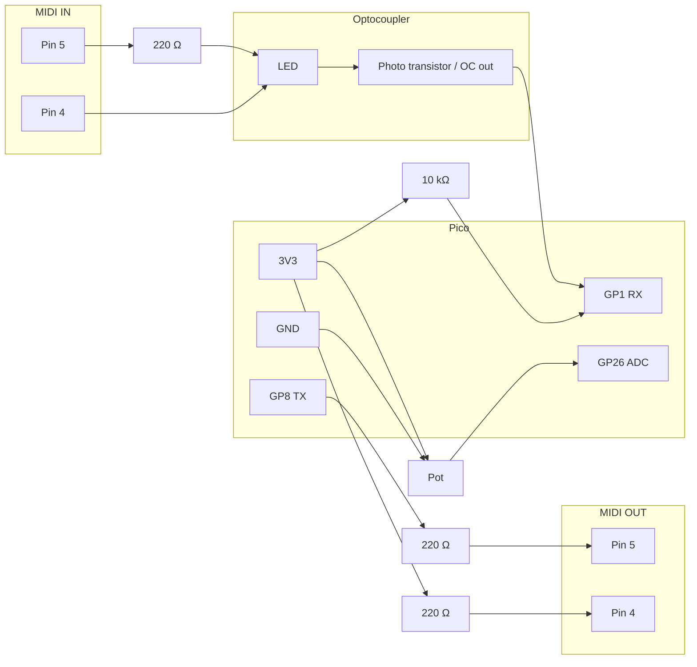

# Connection diagram — MIDI channel merger

Use this when your parts arrive. **Always confirm DIN jack pin numbers** on *your* jack’s datasheet (solder-side / rear view).

**Pico:** 3.3 V logic. Power = **USB only** (no 5 V on MIDI from the Pico).

---

## Block overview

```text
  [ Guitar / Squier MIDI OUT ]          [ Your synth, e.g. Mother-32 ]
           |                                        ^
           | DIN cable                              | DIN cable
           v                                        |
      +----------+                             +----------+
      | MIDI IN  |                             | MIDI OUT |
      | jack     |                             | jack     |
      +----------+                             +----------+
           | opto                                  ^
           v                                       |
      +----------+    GP1 GP8 GP26    +-----------+
      | Raspberry Pi Pico (USB power) |
      +----------+
           |
      +----------+
      | Pot B10K |  (channel 1–16)
      +----------+
```

---

## MIDI IN — guitar → optocoupler → Pico

Current from the guitar flows through the opto **LED**; the **transistor side** is isolated and pulls **GP1** low when the LED is on.

```text
  MIDI IN jack (female)          Optocoupler              Pico
  ---------------------          -------------            ----

  Pin 5 (hot) ----[ 220 Ω ]-----+---- LED anode
                                 |
  Pin 4 (return) ----------------+---- LED cathode

  Pin 2 (shield) ---------------------------------- GND

  Opto GND ----------------------+------------------ GND
  Opto VCC ----------------------+------------------ 3V3   (see chip datasheet)

  Opto digital OUT (open collector) --+--[ 10 kΩ ]-- 3V3
                                      |
                                      +------------ GP1  (UART0 RX)

  Optional 1N4148: cathode toward the 220 Ω / pin-5 side, anode toward
  pin 4 — reverse protection for the LED (many builds omit it).
```

**6N138 (typical DIP-8)** — *verify against your part’s PDF:*

| DIP pin | Function (typical) |
|---------|---------------------|
| 2 | LED anode |
| 3 | LED cathode |
| 5 | GND (logic side) |
| 6 | Output (open collector → GP1 + 10 kΩ to 3V3) |
| 7 | Often bias (datasheet may show resistor to VCC) |
| 8 | VCC (3.3 V) |

**6N137 / PC900** use different pinouts — **do not assume** the same numbers; match **anode, cathode, GND, VCC, output** from the labels above to the correct pins on *your* package.

---

## MIDI OUT — Pico → synth

Resistor-only “lazy” MIDI output (fine for short cables to modern gear):

```text
  Pico                          MIDI OUT jack (female)
  ----                          ----------------------

  GP8 (UART1 TX) ----[ 220 Ω ]------ Pin 5 (hot)

  3V3 --------------[ 220 Ω ]------ Pin 4

  GND ------------------------------ Pin 2 (shield / ground)
```

---

## Channel pot — B10K → ADC

```text
  Pico 3V3 ---- terminal A ----+
                               )
  Pot B10K (linear)            ) wiper ---- GP26 (ADC0)
                               )
  Pico GND --- terminal B -----+

  Optional: [ 100 nF ] between wiper and GND (quieter ADC).
```

If the pot is **not** installed, set **`USE_CHANNEL_POT = False`** in `firmware/main.py`.

---

## USB

- **USB** on the Pico → charger or power bank (**data not required** for the merger to run).

---

## Mermaid (signal flow)



---

## Quick checklist before first power-on

- [ ] **GND** common: both DIN pin 2, Pico GND, pot, opto logic GND tied together.
- [ ] **No 5 V** from Pico onto MIDI pins — only **3.3 V** for pull-ups and lazy OUT.
- [ ] **Opto LED** polarity: pin 5 of MIDI IN → resistor → **anode**; pin 4 → **cathode**.
- [ ] **GP1** not shorted to 5 V (guitar is current loop; opto output is 3.3 V domain).

Related: [HARDWARE.md](../HARDWARE.md) (BOM, notes), [SOFTWARE.md](SOFTWARE.md) (pins in code).
